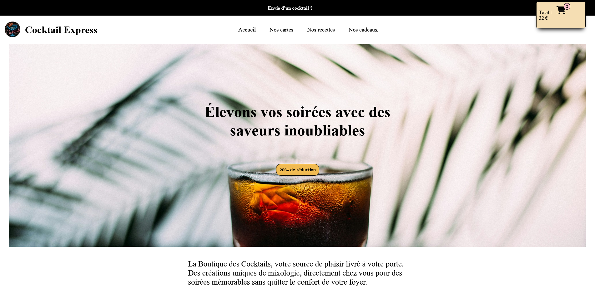
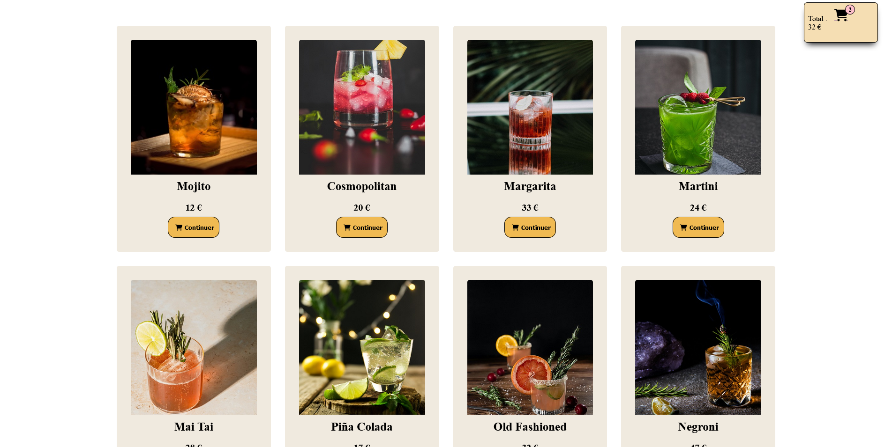
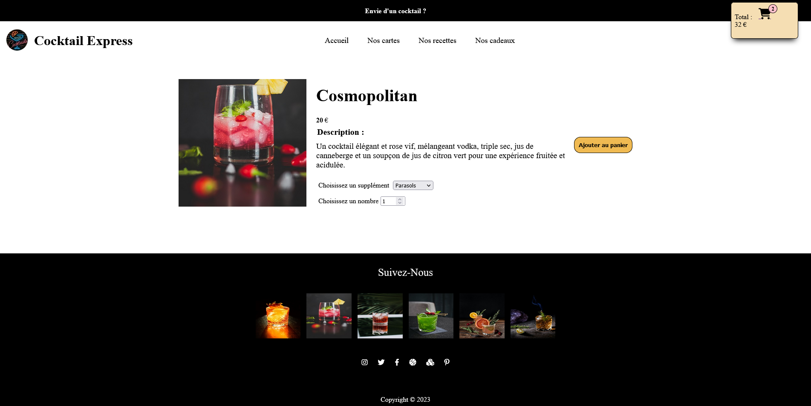

# Cocktails Express

  
  
  
  

## Faux site e-commerce qui enregistre les choix des clients

## Technos :

## Description:

Un serveur Node.js stocke les articles dans un tableau JS statique. 
Les articles sont ajoutables dans un panier avec des opérations CRUD, comprenant le calcul des prix et des quantités. 
Les produits sont affichés dynamiquement à l'aide de requêtes HTTP et d'URLs. 
Le panier est une clé dans le localStorage. 
L'architecture est découpée en modules (fonctions, requêtes, index).

### Installer Node.js 

### Installer les dependances:
`npm install`

### lancer le serveur:
`node server`

### Lancer l'application:
`npm run start`
